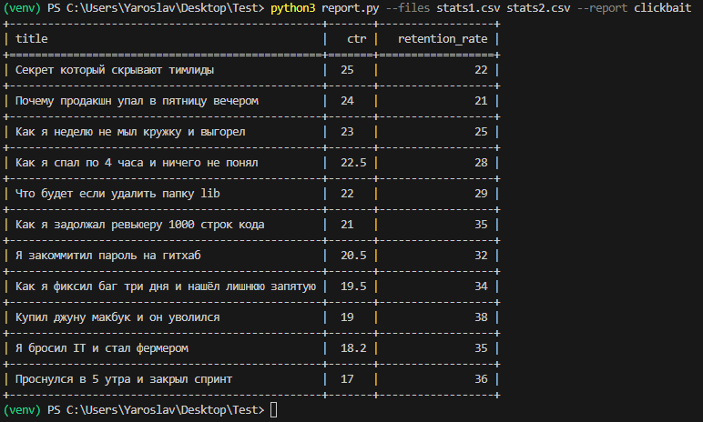
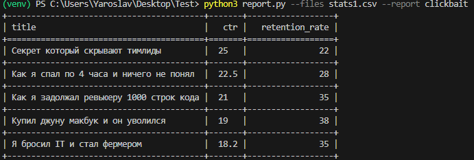

<h1 align="center">Генератор отчётов</h1>
Cli-приложение для обработки csv-файлов с метриками видео на YouTube.

<h2 align="center">Требования</h2>
Основные:
python 3.10+
tabulate

Для тестов:
pytest
pytest-cov

<h2 align="center">Пример ввызова</h2>

<h2 align="center">Добавление нового отчёта</h2>
1.Создайте новый метод в классе VideoReportGenerator.
2.У метода должна быть такая сигнатура: 
    def имя_метода(self, videos: List[Video]) -> Tuple[List, List[str]]:.
3.Вызывайте через --report <Имя-метода>
    